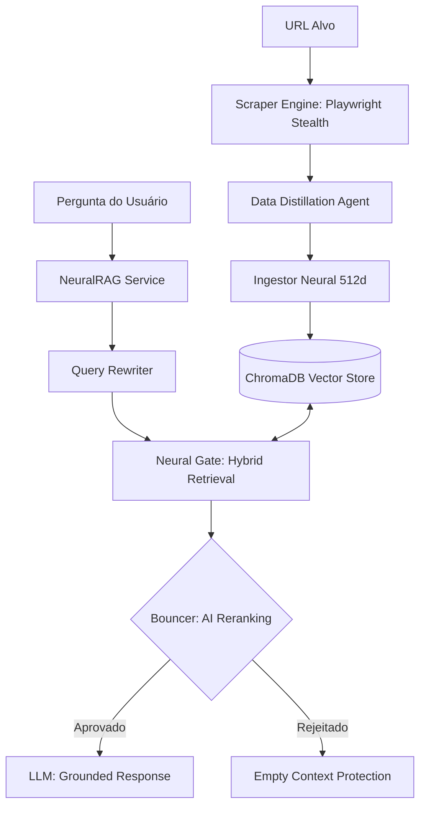

# NeuralSafety: Enterprise RAG Workflow Master

Este documento detalha o pipeline de alta performance do motor NeuralSafety, desde a captura de dados brutos até a entrega de respostas validadas por IA.

## 🏗️ Arquitetura Geral do Pipeline

O sistema opera em uma estrutura de **Microserviço Desconectado**, onde a ingestão de dados e a inferência de respostas são processos independentes mas perfeitamente sincronizados através de uma base vetorial comum.

---

## 🛰️ 1. Motor de Ingestão (NeuralSync)

O pipeline de entrada foi projetado para transformar a "sujeira" da web em dados de alta fidelidade.

- **Scraper Stage (Playwright Stealth):** Utiliza emulação biométrica de mouse e scroll para contornar proteções anti-bot. Capta o HTML integral em modo *Headless*.
- **DataDistiller (Limpeza Semântica):** Remove tags desnecessárias e preserva apenas a essência textual e hierárquica (ARIA).
- **Vetorização Otimizada:** Utiliza `text-embedding-3-small` com **512 dimensões (Matryoshka)**. Esta "sacada" técnica permite que o banco seja 3x mais leve sem perda de inteligência.

---

## 🏛️ 2. Motor de Resposta (NeuralGate)

Diferente de RAGs comuns que sofrem com alucinações, o NeuralGate utiliza uma arquitetura de **Triagem Militar**.

### O Portão de Três Camadas:
1.  **Zona Verde (Confiança Total):** Resultados com distância vetorial < 0.22. São processados instantaneamente.
2.  **Zona Amarela (Ambiguidade):** Resultados entre 0.22 e 0.48 de distância. São escalados para o **Agente Bouncer**.
3.  **Zona Vermelha (Ruído):** Resultados > 0.48 são descartados permanentemente para evitar gasto de tokens e alucinações.

### Agente Bouncer (Reranking Binário)
Um sub-agente especializado (`GPTo-mini`) analisa cada trecho da Zona Amarela e decide se a informação é útil para o usuário. Isso garante que a resposta final seja **100% Grounded**.

---

## 📊 3. Auditoria e Controle (Tiktoken)

Todo o fluxo de dados é auditado em tempo real pelo motor de tokenização `cl100k_base`.
- **Previsibilidade de Custos:** Sabemos o custo exato da operação antes dela ser concluída.
- **Proteção de Contexto:** Garante que o prompt final nunca exceda os limites de atenção da IA, mantendo a resposta sempre focada.

---

## 🐳 4. Deployment Strategy (Próximo Nível)
O sistema foi modularizado para ser empacotado em imagens **Docker Ofuscadas**. Isso permite:
- Entrega On-Premise (Nível Militar).
- Proteção total da Propriedade Intelectual (IP).
- Escalabilidade via Clusters (K8s).

---
*Relatório arquitetural v2.1 - Preparado para transição Enterprise.*
