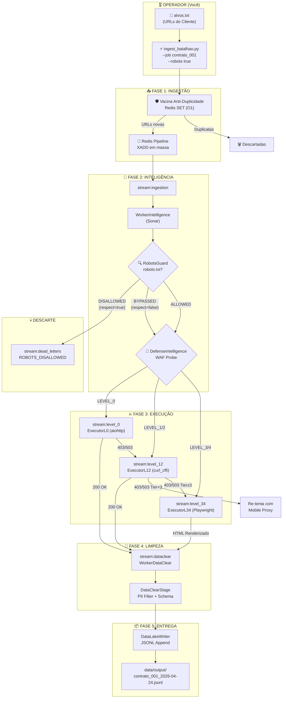

# Fluxo de Pipeline Atualizado — Crawler de Batalhão
## Mapa Completo de Operação (v2.0)

---

## Comandos do Operador (Você)

```
Terminal 1 (fica aberto):              Terminal 2 (dispara e sai):
─────────────────────────              ────────────────────────────
docker compose up -d                   python ingest_batalhao.py
python -m core.main_batalhao             missoes/alvos.txt
                                         --job contrato_001
                                         --robots true
```

---

## Pipeline Interno (Automático)



---

## Detalhamento por Fase

### FASE 1 — Ingestão (`ingest_batalhao.py`)
| Etapa | O que acontece | Tecnologia |
|---|---|---|
| Leitura | Carrega o `.txt`, ignora comentários `#` e linhas vazias | Python IO |
| Deduplicação | `SADD` no Redis SET `batalhao:global_dedup` | Redis SET O(1) |
| Injeção | `XADD` em massa via Pipeline TCP | Redis Pipeline |

### FASE 2 — Inteligência (`WorkerIntelligence`)
| Etapa | O que acontece | Tecnologia |
|---|---|---|
| Robots Check | Busca `robots.txt` do domínio (cache 24h no Redis) | Protego + aiohttp |
| WAF Probe | Dispara HEAD/GET leve para detectar Cloudflare, Datadome, etc. | aiohttp probe |
| Roteamento | Decide para qual executor enviar (L0, L12 ou L34) | DefenseIntelligence |

### FASE 3 — Execução (Executores)
| Executor | Arma | Custo | Quando usa |
|---|---|---|---|
| **L0** (aiohttp) | HTTP puro, sem JS | Zero | Sites sem defesa |
| **L12** (curl_cffi) | TLS Spoofing Chrome 120 | Zero | Cloudflare simples |
| **L34** (Playwright) | Chrome real + JS + Stealth | Alto (RAM) | Datadome, PerimeterX |

> Se L0 falha → escala para L12 → se L12 falha → escala para L34

### FASE 4 — Limpeza (`WorkerDataClear`)
| Etapa | O que acontece |
|---|---|
| Parse HTML | BeautifulSoup converte em DOM navegável |
| PII Filter | Remove CPFs, emails, telefones do conteúdo |
| Schema v2 | Gera `id_hash`, `markdown_body`, `semantic_chunks`, `compliance` |

### FASE 5 — Entrega (`DataLakeWriter`)
| Saída | Formato | Local |
|---|---|---|
| Dataset | JSONL (1 JSON por linha) | `data/output/{job_id}_{data}.jsonl` |

---

## Variáveis que Você Controla (`.env`)

```env
# Chave de Proxy (rotação de IP)
PROXIES_SX_API_KEY=

# Potência do Motor (abas simultâneas)
BATALHAO_CONCURRENCY_L0=20     # Requisições HTTP puras
BATALHAO_CONCURRENCY_L12=15    # TLS Spoofing
BATALHAO_CONCURRENCY_L34=5     # Abas Chrome (pesado)

# Conexão Redis
REDIS_URL=redis://localhost:6379
```

## Flags que Você Controla (por missão)

```bash
python ingest_batalhao.py alvos.txt \
  --job contrato_001 \       # Nome do arquivo de saída
  --robots true              # Respeitar robots.txt? (true/false)
```
