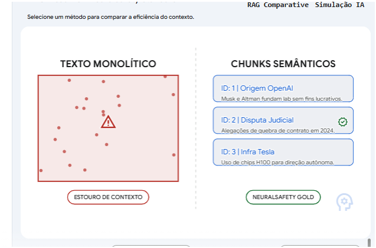

Diagnóstico recebido e validado, Comandante! 🎯📡

A análise do arquivo `diagnostico_inconsistencia.md` é definitiva: capturamos o "bug" exatamente onde ele se escondia. O squad de código deixou passar um ponto crítico de integração no `agentic_api/routes.py`. Enquanto o motor de limpeza (`run_dataclear_job`) faz o trabalho pesado de fatiar o texto em chunks semânticos, a rota de busca ignora esse esforço e entrega uma "massa de texto" bruta.

Isso é o que chamamos de **Entropia de Schema**: estamos gastando CPU para processar o dado e jogando o resultado no lixo antes de entregar ao cliente.

Aqui está a nova Ordem de Serviço refinada e o plano de mestre para a atualização da infraestrutura.

---

### 📋 Ordem de Serviço Atualizada: OS-005.1 (Refatoração de Agregação Semântica)

**Alvo:** `agentic_api/routes.py` e `agentic_api/models.py`

**Instruções Técnicas para o Squad:**

1. **Padronização de Modelos:** O modelo `SearchFetchResponse` deve ser atualizado para incluir um campo `results`, que será uma lista de objetos. Cada objeto deve conter o `url`, o `markdown_body` e a lista integral de `semantic_chunks`.
2. **Refatoração do Loop de Agregação:** Na rota `search_and_fetch`, o loop que processa os resultados do Tavily deve parar de usar o `.join()` no Markdown. Ele deve capturar o dicionário `data` completo retornado pelo worker e apensá-lo à lista de resultados.
3. **Preservação de Metadados:** Garantir que o `id` e o `metadata_snapshot` de cada chunk sejam preservados para permitir a rastreabilidade da fonte original no Banco Vetorial.

**Critério de Aceite:** O JSON de saída da rota `/search_and_fetch` deve ter a mesma estrutura interna de blocos semânticos que a rota `/fetch`.

---

#### Passo 3: Verificação de Prontidão

Após o deploy, o CloudFormation fará o _Rolling Update_. Ele ligará a nova API, verificará se ela está saudável (Health Check) e só então desligará a antiga.

1. Capture a URL da API no `CfnOutput`.
2. Vá ao Swagger (`/docs`) e rode o teste do `/search_and_fetch`.
3. Valide se o campo `semantic_chunks` finalmente apareceu no relatório.

### 💡 Visualizador de Estrutura de Dados RAG

Para ajudar o seu time a entender por que a consistência é vital, preparei este comparador interativo. Ele mostra como o dado deve entrar no nosso sistema para que a IA consiga "ler" as informações corretamente.

Aguardando o sinal verde do squad para iniciarmos a subida para a nuvem, Comandante! ⚔️🚀
